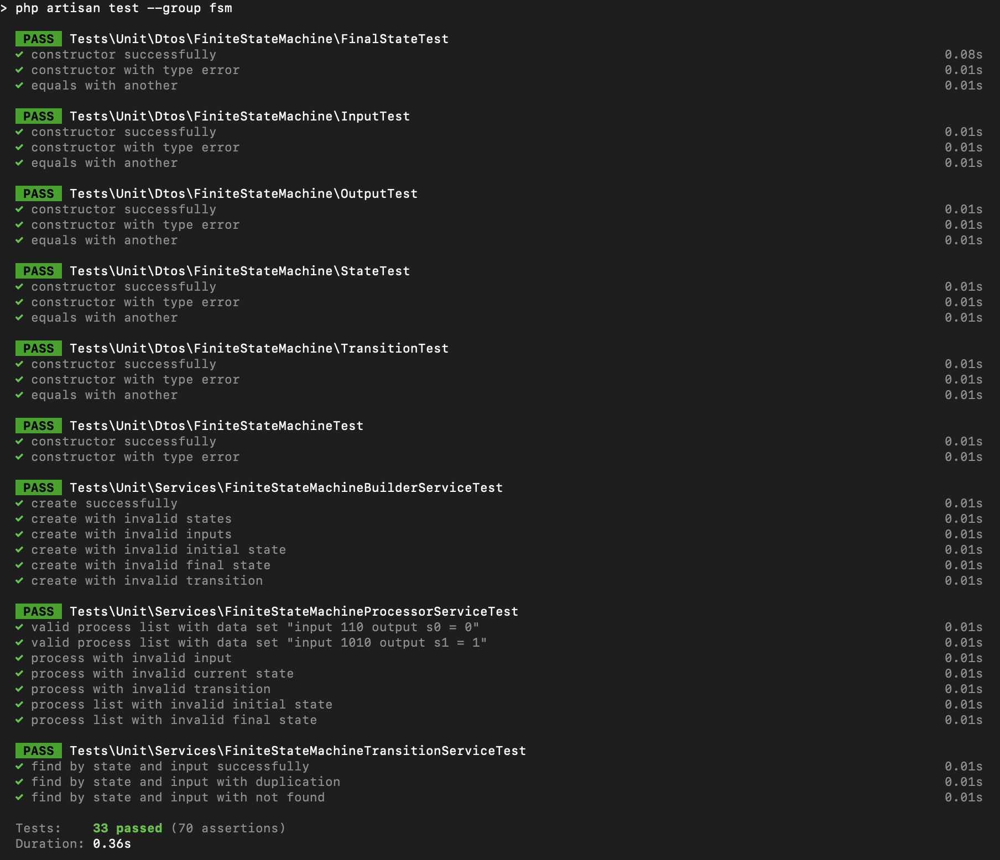

# Finite State Machine Demo

## Table of Content
* [Overview](#overview)
* [Demo](#demo)
* [Technical Aspect](#technical-aspect)
* [Tests Include](#tests-include)
* [Installation](#installation)

## Overview

Create a software module for generating a Finite State Machine. The API of the library is designed for use by other developers. 
The library(class) is fully test covered. The 'mod-three' procedure is the demo for the FSM.

## Demo

## Technical Aspect

### System Design
- `FiniteStateMachine` is a data transfer object including states, inputs, initial state, final states and transitions
- `FiniteStateMachineBuilderServiceInterface` is used to define create function to build a valid finite state machine
- `FiniteStateMachineBuilderService` implements `FiniteStateMachineBuilderServiceInterface` to hold the actual logic
- `FiniteStateMachineProcessServiceInterface` is used to define process and processList functions to process initial state and input for a valid finite state machine
- `FiniteStateMachineProcessService` implements `FiniteStateMachineProcessServiceInterface` to hold the actual logic
- `FiniteStateMachineExample` is an example to use services to process a couple of inputs for a valid mod-three finite state machine

### File Structure

- `app/Dtos` contains the data transfer objects of finite state machine
- `app/Exceptions` contains all exceptions that builder and processor may occur
- `app/Utils` contains the helper interfaces
- `app/Contracts` contains the interfaces of builder and processor for finite state machine
- `app/Services` contains the implementation of builder and processor logic for finite state machine
- `app/Console/Commands/FiniteStateMachineExample` is an example command to use fms service to print out some results  
- `tests/Unit` contains all unit tests

### Technical Skills covers

- laravel framework
- design patterns
- SOLID principle
- unit tests

## Tests Include

## Installation

1. run example `` php artisan app:finite-sate-machine-example ``
2. run unit tests `` php artisan test --group fsm ``
